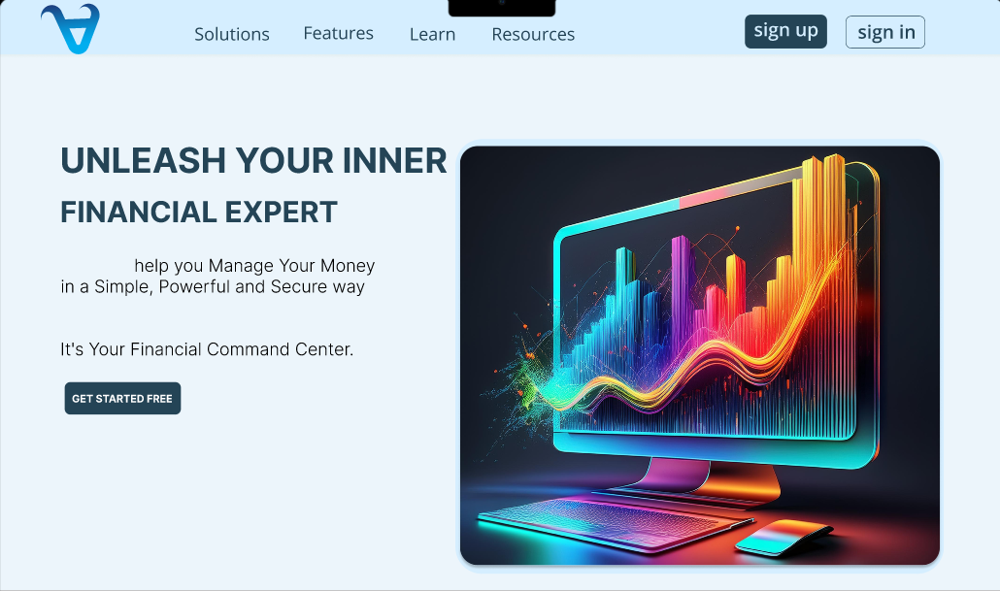

<a name="top"></a>

# MONEY DA VINCI PORTOFIO PROJECT



⭐ Star us on GitHub — it motivates us a lot!

[](https://x.com/intent/tweet?text=Check%20out%20this%20project%20on%20GitHub:%20https://github.com/Gideon-Phiri/moneydavinci.)
[](https://www.facebook.com/sharer/sharer.php?u=https://github.com/Gideon-Phiri/moneydavinci)
[](https://www.linkedin.com/sharing/share-offsite/?url=https://github.com/Gideon-Phiri/moneydavinci)
[](https://www.reddit.com/submit?title=Check%20out%20this%20project%20on%20GitHub:%20https://github.com/Gideon-Phiri/moneydavinci)
[](https://t.me/share/url?url=https://github.com/Gideon-Phiri/moneydavinci&text=Check%20out%20this%20project%20on%20GitHub)

## Table of Contents

- [Introduction](#-introduction)
- [How to Run](#-how-to-run)
- [Getting Started](#-dgetting-started)
- [Feedback and Contributions](#-feedback-and-contributions)
- [License](#-license)
- [Contacts](#%EF%B8%8F-contacts)

## 🚀 Introduction

**Money da vinci** is a financial infrastructure web application designed to help individual to manage their finances in one place. It adheres to high standards of flexibility, reusability, and reliability, utilizing well-known software design patterns, including modular and hexagonal architectures.

## 📝 How to Run

To run the app on localhost, follow these steps:

```shell
# Open a terminal (Command Prompt or PowerShell for Windows, Terminal for macOS or Linux)

# Ensure Git is installed
# Visit https://git-scm.com to download and install console Git if not already installed

# Clone the repository
git clone https://github.com/Gideon-Phiri/moneydavinci.git

# Navigate to the project directory
cd moneydavinci

# Initiate the project
npm i
# or
yarn i
# or
pnpm i
# or
bun i

# run the development server:
npm run dev
# or
yarn dev
# or
pnpm dev
# or
bun dev

```

### Getting Started

- **create an account**

- **link your bank**

- **set your goal**

This tool is ideal for both new users and experienced financial analyst seeking to up game their personal financial standing.

## 🤝 Feedback and Contributions

We've made every effort to implement all the main aspects of the app in the best possible way. However, the development journey doesn't end here, and your input is crucial for our continuous improvement.

> [!IMPORTANT]
> Whether you have feedback on features, have encountered any bugs, or have suggestions for enhancements, we're eager to hear from you. Your insights help us make [money da vinci] more robust and user-friendly.

Please feel free to contribute by [submitting an issue](https://github.com/Gideon-Phiri/moneydavinci/issues). Each contribution helps us grow and improve.

We appreciate your support and look forward to making our product even better with your help!

## 📃 License

This product is distributed under a proprietary license.

For non-commercial use, this product is available for free.

## 🗨️ Contacts

For more details about our products, services, or any general information regarding the Money da Vinci, feel free to reach out to us. We are here to provide support and answer any questions you may have. Below are the best way to contact our team:

- **Email**: Send us your inquiries or support requests on [gideonphiri032@gmail.com](mailto:gideonphiri032@gmail.com).

Subscribe to our LinkedIn:

[![LinkedIn](https://img.shields.io/badge/subscribe-white.svg?logo=data:image/svg%2bxml;base64,PHN2ZyB2aWV3Qm94PSIwIDAgMjQgMjQiIHhtbG5zPSJodHRwOi8vd3d3LnczLm9yZy8yMDAwL3N2ZyI+PHBhdGggZD0iTTIwLjQ0NyAyMC40NTJoLTMuNTU0di01LjU2OWMwLTEuMzI4LS4wMjctMy4wMzctMS44NTItMy4wMzctMS44NTMgMC0yLjEzNiAxLjQ0NS0yLjEzNiAyLjkzOXY1LjY2N0g5LjM1MVY5aDMuNDE0djEuNTYxaC4wNDZjLjQ3Ny0uOSAxLjYzNy0xLjg1IDMuMzctMS44NSAzLjYwMSAwIDQuMjY3IDIuMzcgNC4yNjcgNS40NTV2Ni4yODZ6TTUuMzM3IDcuNDMzYTIuMDYyIDIuMDYyIDAgMCAxLTIuMDYzLTIuMDY1IDIuMDY0IDIuMDY0IDAgMSAxIDIuMDYzIDIuMDY1em0xLjc4MiAxMy4wMTlIMy41NTVWOWgzLjU2NHYxMS40NTJ6TTIyLjIyNSAwSDEuNzcxQy43OTIgMCAwIC43NzQgMCAxLjcyOXYyMC41NDJDMCAyMy4yMjcuNzkyIDI0IDEuNzcxIDI0aDIwLjQ1MUMyMy4yIDI0IDI0IDIzLjIyNyAyNCAyMi4yNzFWMS43MjlDMjQgLjc3NCAyMy4yIDAgMjIuMjIyIDBoLjAwM3oiIGZpbGw9IiMwQTY2QzIiLz48cGF0aCBzdHlsZT0iZmlsbDojZmZmO3N0cm9rZS13aWR0aDouMDIwOTI0MSIgZD0iTTQuOTE3IDcuMzc3YTIuMDUyIDIuMDUyIDAgMCAxLS4yNC0zLjk0OWMxLjEyNS0uMzg0IDIuMzM5LjI3NCAyLjY1IDEuNDM3LjA2OC4yNS4wNjguNzY3LjAwMSAxLjAxYTIuMDg5IDIuMDg5IDAgMCAxLTEuNjIgMS41MSAyLjMzNCAyLjMzNCAwIDAgMS0uNzktLjAwOHoiLz48cGF0aCBzdHlsZT0iZmlsbDojZmZmO3N0cm9rZS13aWR0aDouMDIwOTI0MSIgZD0iTTQuOTE3IDcuMzc3YTIuMDU2IDIuMDU2IDAgMCAxLTEuNTItMi42NyAyLjA0NyAyLjA0NyAwIDAgMSAzLjQxOS0uNzU2Yy4yNC4yNTQuNDIuNTczLjUxMi45MDguMDY1LjI0LjA2NS43OCAwIDEuMDItLjA1MS4xODYtLjE5Ny41MDQtLjMuNjUyLS4wOS4xMzItLjMxLjM2Mi0uNDQzLjQ2NC0uNDYzLjM1Ny0xLjEuNTAzLTEuNjY4LjM4MlpNMy41NTcgMTQuNzJWOS4wMDhoMy41NTd2MTEuNDI0SDMuNTU3Wk05LjM1MyAxNC43MlY5LjAwOGgzLjQxMXYuNzg1YzAgLjYxNC4wMDUuNzg0LjAyNi43ODMuMDE0IDAgLjA3LS4wNzMuMTI0LS4xNjIuNTI0LS44NjUgMS41MDgtMS40NzggMi42NS0xLjY1LjI3NS0uMDQyIDEtLjA0NyAxLjMzMi0uMDA5Ljc5LjA5IDEuNDUxLjMxNiAxLjk0LjY2NC4yMi4xNTcuNTU3LjQ5My43MTQuNzEzLjQyLjU5Mi42OSAxLjQxMi44MDggMi40NjQuMDc0LjY2My4wODQgMS4yMTUuMDg1IDQuNTc4djMuMjU4aC0zLjUzNnYtMi45ODZjMC0yLjk3LS4wMS0zLjQ3NC0uMDc0LTMuOTA4LS4wOS0uNjA2LS4zMTQtMS4wODItLjYzNC0xLjM0Mi0uMzk1LS4zMjItMS4wMjktLjQzNy0xLjcwMy0uMzA5LS44NTguMTYzLTEuMzU1Ljc1LTEuNTIzIDEuNzk3LS4wNzYuNDcxLS4wODQuODQ1LS4wODQgMy44MzR2Mi45MTRIOS4zNTN6Ii8+PC9zdmc+)](https://www.linkedin.com/in/gideon-phiri22/)

We look forward to assisting you and ensuring your experience with our products is successful and enjoyable!

[Back to top](#top)
